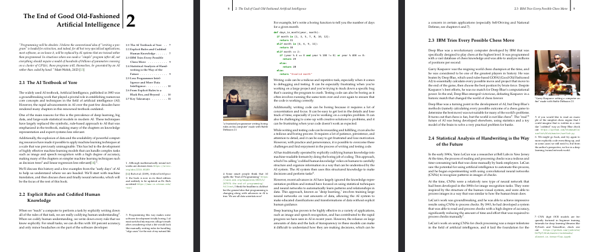

# AI Harmony 🌟🤖

The source text and LaTeX formatting for AI Harmony by [Brad Flaugher](https://bradflaugher.com)


## Buying or Compiling Your Own PDF Copy 📄

The pdf copy of the book has many fancy formatting options enabled, see the preview below.



Get a pdf copy of AI Harmony via one of the following options:

### Option 1: Buy a Copy 🛍️

Visit [https://aiharmony.info](https://aiharmony.info) to explore a range of purchasing options: DRM-Free ```.pdf```s, Kindle, and printed hardcover editions are all available.

### Option 2: Compile via a ```podman``` Container (Recommended) 🚀

1. install [podman](https://podman.io/)
2. ```cd``` to project folder
3. ```sh runpodman.sh```
4. the book will be output in the file ```main.pdf```

### Option 3: Compile Using Local TexLive Installation 🖥️

1. install texlive (on debian-based GNU/Linux distros) with ```sudo apt install texlive-full```
2. run ```sh makebook.sh``` to compile
4. the book will be output in the file ```main.pdf```

## Key Files and Folders 📂

* `chapters`: the text of the book (with margin notes) 
* `images`: AI-generated images that adorn the margins
* `main.tex`: formatting LaTeX code
* `main.bib`: the bibliography

## Formatting help, advice for your own book

Refer to the [Kaobook project](https://github.com/fmarotta/kaobook), upon which AI Harmony is based.

## Supporting the Author

* 📚 [Buy a book (and leave a review please ⭐⭐⭐⭐⭐)](https://aiharmony.info)
* 👕 [Buy a T-Shirt](https://store.bradflaugher.com/)
* 💵 [Make a Donation via Coinbase](https://commerce.coinbase.com/checkout/ea43ea82-2708-4562-966b-bf30800ec592)
* 🫶  [Join Brad's Patreon and get AI Analyisis, Career Support, Ebooks and Merch](https://www.patreon.com/bradflaugher)

## Contributing and TODOs

If you'd like to contribute a chapter, revisions or whatever you like, you can email Brad at [brad@bradflaugher.com](mailto:brad@bradflaugher.com) or just submit a PR.

If you'd like to see what I am working on for the second edition see [TODO.md](./TODO.md).

## Copyright and GPL Notice ©️

"AI Harmony" Copyright 2023 Brad Flaugher

This program is free software: you can redistribute it and/or modify it under the terms of the GNU General Public License as published by the Free Software Foundation, either version 3 of the License, or (at your option) any later version.

This program is distributed in the hope that it will be useful, but WITHOUT ANY WARRANTY; without even the implied warranty of MERCHANTABILITY or FITNESS FOR A PARTICULAR PURPOSE. See the GNU General Public License for more details.

## Kaobook Acknowledgment 📖

The kaobook class, consisting of kaobook.cls, kaohandt.cls, and kao.def are licensed under the LaTeX Project Public License. The kaobook project can be found at [https://github.com/fmarotta/kaobook](https://github.com/fmarotta/kaobook)

