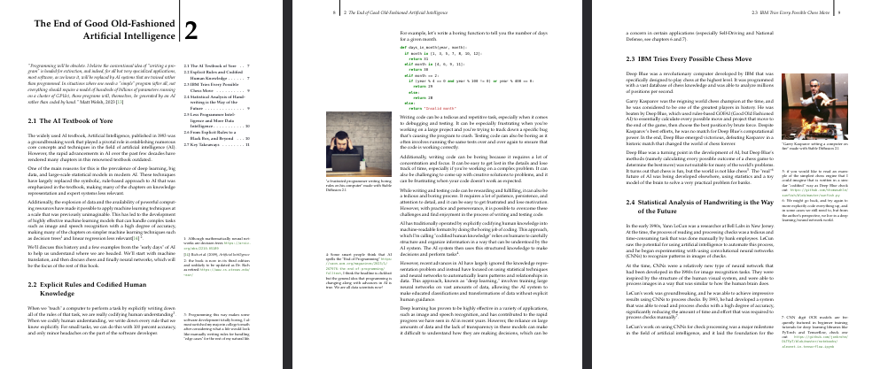

# AI Harmony 🌟🤖

The source text and LaTeX formatting for AI Harmony by [Brad Flaugher](https://bradflaugher.com)

> **📘 New: The Fable Edition (2026).** AI Harmony has been revised and updated. New for this edition: a retrospective preface, blue `2026 update:` margin notes throughout, a model card for the Agentic Coworker, and major new sections on the open-source race to the bottom, the author's Tesla confession, and the arrival of the drone wars. The update was produced the way the book says work should be produced — the human author collaborating with an AI agent (built on a model named Fable, hence the name). Get the PDF from [releases](https://github.com/bradflaugher/AI-Harmony-Book/releases). The professionally narrated audiobook follows the first edition text.


# Getting a copy of AI Harmony

The pdf copy of the book has many fancy formatting options enabled, see the preview below.



Get a copy of AI Harmony via one of the following steps:

## Option 1: Download an epub, pdf or the audiobook
* See [releases](https://github.com/bradflaugher/AI-Harmony-Book/releases) for epub, pdf, and audiobook downloads (the Fable Edition PDF is the latest release).

## Option 2: Compile the pdf via a ```podman``` Container 🚀

1. install [podman](https://podman.io/)
2. ```cd``` to project folder
3. ```bash runpodman.sh```
4. the book will be output in the file ```main.pdf```

## Option 3: Compile Using Local TexLive Installation 🖥️

1. install texlive (on debian-based GNU/Linux distros) with ```sudo apt install texlive-full```
2. run ```bash makebook.sh``` to compile
4. the book will be output in the file ```main.pdf```

# Key Files and Folders 📂

* `chapters`: the text of the book (with margin notes) 
* `images`: AI-generated images that adorn the margins
* `main.tex`: formatting LaTeX code
* `main.bib`: the bibliography

# Formatting help, advice for your own book

Refer to the [Kaobook project](https://github.com/fmarotta/kaobook), upon which AI Harmony is based.

# Contributing and TODOs

If you'd like to contribute a chapter, revisions or whatever you like, you can email Brad at [brad@bradflaugher.com](mailto:brad@bradflaugher.com) or just submit a PR.

If you'd like to see what I am working on for the second edition see [TODO.md](./TODO.md).

# Copyright and GPL Notice ©️

"AI Harmony" Copyright 2023, 2026 Brad Flaugher

This program is free software: you can redistribute it and/or modify it under the terms of the GNU General Public License as published by the Free Software Foundation, either version 3 of the License, or (at your option) any later version.

This program is distributed in the hope that it will be useful, but WITHOUT ANY WARRANTY; without even the implied warranty of MERCHANTABILITY or FITNESS FOR A PARTICULAR PURPOSE. See the GNU General Public License for more details.

## Kaobook Acknowledgment 📖

The kaobook class, consisting of kaobook.cls, kaohandt.cls, and kao.def are licensed under the LaTeX Project Public License. The kaobook project can be found at [https://github.com/fmarotta/kaobook](https://github.com/fmarotta/kaobook)

